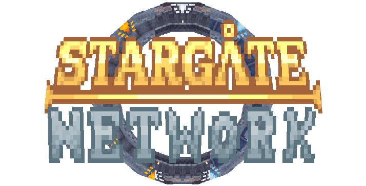

AIT extras but its not ait and its actually stargate :D

-------------

 <!-- SVG version -->

 <!-- SVG version -->

-------------
 please do not upload this to any other site without Addie's permission
-------------

<h2>
  
  Small Q&A!
</h2>

### What does this add / do?

- This adds features from the shows/movies that the Stargate mod doesn't, such as:
    - New blocks / Items
    - Planets
    - Mobs
    - Decorations
    - And more!

### Will this mod be ported to forge or neoforge?

- Nope, this mod will be exclusively for fabric. I don't feel like porting the mod every time and have 0 idea how.

### How do i get access to betas?
- Via [My kofi](https://ko-fi.com/addi3dabaddie)!

### Can you add... / How do you use...?
- You can suggest stuff on the github issues page or on [My Discord](https://discord.gg/kndce97FyU)! I will also answer any questions on either site!

-------------
-------------

<h2>
  
  Required Mods!
</h2>

- Requires AmbleKit (latest 1.20.1 version) -> [Download Here](https://modrinth.com/mod/amblekit/versions)

- Requires Fabric API (latest 1.20.1 version) -> [Download Here](https://modrinth.com/mod/fabric-api/versions?g=1.20.1&l=fabric)

- Requires Stargate (VERSION) -> [Download Here](https://modrinth.com/mod/amble-stargate)

<h2>
  
  Recommended Mods!
</h2>

- JEI (latest fabric 1.20.1 version) -> [Download Here](https://modrinth.com/mod/jei/versions?g=1.20.1&l=fabric)

**Alternativly**

- REI (latest fabric 1.20.1 version) -> [Download Here](https://modrinth.com/mod/rei/versions?g=1.20.1&l=fabric)

-------------
-------------

<h2>
  
  Credits
</h2>

### Developers:
- [Addi3_Astarr](https://addi3.github.io/) (Lead Developer)

-------------
-------------

<h2>
  
  Links
</h2>

### - [Modrinth](https://modrinth.com/project/stargate-network)
### - [Github](https://github.com/Addi3/Stargate-Network)
### - [Discord Server](https://discord.gg/kndce97FyU)
### - CurseForge `COMING SOON`